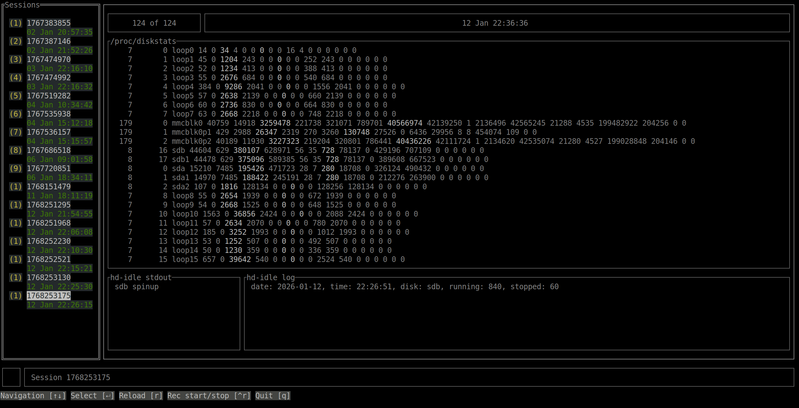

# hd-idle test suite

Tool to help testing hd-idle for real usecase scenarios

_Requirements:_
- Go: https://go.dev/doc/install
- Preferred Systemd

## Daemon

To build it, use the command:

```
$ make
# make install
```

_Note_: `make install` will fail on the last step if SystemD is not present, but the daemon can still run with:

```
# /usr/bin/hdtd
```

## TUI

To build it, use the command:

```
$ make
# make install
```

## Setup a usecase

Make sure you stop hd-idle service before running the usecase. e.g. `systemctl stop hd-idle`

Start hd-idle in the terminal with the argument `-l /var/log/hd-idle.log` and redirect the output to a file `/tmp/hd-idle.out`.

e.g.
```
# nohup /usr/sbin/hd-idle -l /var/log/hd-idle.log > /tmp/hd-idle.out
```

Start the daemon if not ard already running. e.g. `systemctl start hdtd`
If you are not using systemd, the daemon can be started manually as root: `hdtd`

Start the TUI: `hdt`

Now you can start the recording pressing `Ctrl + r` and run your usecase (Notice the `R` in the bottom left corner when recoding is active). The daemon will record the events. You can press `r` to load the recorded events right away.

_Note_: Once the recording is running, you can safely quit the TUI, the daemon will continue recording in the background.

## Navigation



On the left panel you can see the available recorded sessions. Navigate with `↑` and `↓` and select one by pressing `Enter`.

On the right panel you can see the details for the selected session (`/proc/diskstats`, `hd-idle stdout` and `hd-idle log`). Navigate through time using `→` to advance and `←` to go back.
`Shift + →` to go forward 10 pages and `Ctrl + →` to go forward 100 pages (also available for `←`).

Press `esc` to go back to the left panel.

## Export a session

To export a session you will need the `id` as shown in the left panel. e.g. `1767536157`
Then you can create a tar ball. e.g.:

```
cd ~/.config/hdtd/ && tar cvfz 1767535444.tar.gz 1767535444
```